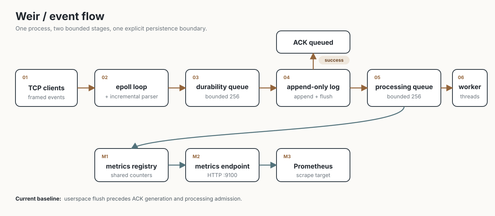
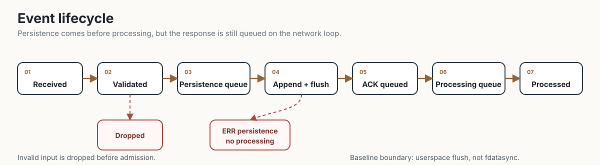

# Weir

Weir is a small Linux-first C++20 event-ingestion service.




**Verified on Linux/ARM64:** real TCP/epoll transport, fragmented streams, half-closes, asynchronous acknowledgements, concurrent clients, partial nonblocking writes, and metrics HTTP behavior are covered by process/socket integration tests.

Stable-storage durability and crash-recovery guarantees are still under development.

## What it demonstrates

- Linux networking with nonblocking TCP and `epoll`
- Incremental framing over a byte stream
- Bounded concurrent queues with explicit capacity limits
- Persistence before processing acknowledgement
- Worker ownership and coordinated shutdown
- Append-only recovery and replay
- Prometheus-compatible metrics and structured logs

## Verified on Linux

- GCC 13.3 and Clang 18.1 with strict warnings
- Real nonblocking TCP/epoll transport (syscalls confirmed with `strace`)
- Fragmented and coalesced TCP frames
- TCP half-close with pending asynchronous ACKs
- Partial nonblocking response writes
- Concurrent clients and malformed-client isolation
- Metrics HTTP endpoint on 127.0.0.1
- Linux process/socket integration tests
- ASan/UBSan and Valgrind-clean tested paths

Still in progress: `fdatasync` durability, process-level crash recovery, Prometheus/Grafana deployment, full observability, and performance characterization.

## Overview

1. A TCP client sends length-delimited `WR01` frames.
2. The parser tolerates arbitrary read fragmentation and rejects bad checksums.
3. Valid events enter a bounded durability queue, are appended and flushed to an append-only log, then enter the processing queue.
4. Worker threads process only events that were successfully appended and flushed.
5. Weir exposes Prometheus-compatible metrics over a local HTTP endpoint on port 9100 by default.

The service is intentionally single-process and has no runtime dependency beyond libc and pthreads.

The lifecycle is validated, queued, appended and flushed, acknowledged, queued for processing, and handled by workers.

## Event lifecycle



The diagram labels the current baseline contract.
The append step uses userspace `flush()`, not `fdatasync()`.

## Build

Requirements: CMake 3.20+ and a C++20 compiler.

```sh
./scripts/build.sh default
```

Use `cmake --preset asan` for AddressSanitizer and UBSan.

Linux runtime integration tests are disabled by default because the server uses Linux epoll APIs.
Enable them on Linux with `-DWEIR_LINUX_INTEGRATION_TESTS=ON` when configuring CMake, then run `ctest --preset default` to include real-socket transport scenarios (fragmentation, half-close, fd reuse, slow readers, malformed-client isolation).

Linux provides the nonblocking TCP/epoll server on port 9000. macOS builds the core and CLI tools, but the server reports that networking is unavailable.

The binary frame is: magic `WR01`, big-endian event id, big-endian payload length, payload, and FNV-1a checksum.

```sh
./build-make/weir-server --port 9000 --log events.wrl
./build-make/weir-producer 127.0.0.1 9000 hello
./build-make/weir-inspect-log events.wrl
./build-make/weir-replay events.wrl
```

Prometheus output is served on `--metrics-port`.

More detail: [protocol](docs/PROTOCOL.md), [persistence and recovery](docs/PERSISTENCE.md), [failure behavior](docs/FAILURES.md), and [architecture](docs/ARCHITECTURE.md).
